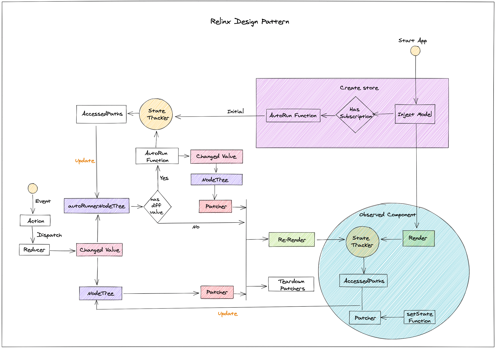
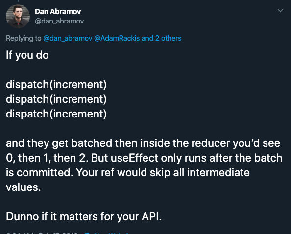

# Relinx

[](https://www.npmjs.com/package/relinx) [](http://www.npmtrends.com/relinx) [](https://github.com/prettier/prettier)

_A fast, intuitive, access path based reactive react state management_

## Features

1. 支持 ES5 和 ES6，通过`Proxy`或者`defineProperty`等 trap 函数，自动记录当前组件所需要响应的属性路径
2. 当源数据发生变化时，只对其对应的 Proxy 对象进行 relink 替换，尽量减少 Proxy 对象的创建
3. 对 PathNode 进行创建时，只会对那些被使用到的属性才进行创建，从而在进行 diff 遍历时提高性能
4. 为了更好的拥抱社区，中间件是基于 Redux-middleware 来实现，可以很快的接入 Redux 社区丰富的中间件库
5. 通过 access paths 的记录，可以更精准的知道组件具体需要的属性以实现粒度化渲染的控制
6. 支持class的写法

## Introduction

遵照`React-Redux`的模式，包含`action`和`dispatch`；但是最终在结构上参考了[dva](https://github.com/dvajs/dva)中的基本概念，比如`model`, `reducers`和`effects`.相比于`dva`借助`redux-saga`实现副作用处理的多样性；目前 relinx 通过基于`redux-thunk`的中间件实现对异步数据的处理。

Relinx 的底层路径搜集上受 functional reactive programming 很大的影响，实现上很大程度借鉴了[immer](https://github.com/immerjs/immer)对 Proxy 和`defineProperty`的处理方式。收集模块叫`Tracker`，借鉴了[Tracker - Meteor's reactive system](https://docs.meteor.com/api/tracker.html)的定义方式。

Relinx 的设计理念很简单

> 记录组件访问的具体属性路径，当源数据变化时触发对应节点上监听的组件



### Tracker

[Tracker - Track the getter action of wrapped object and provide ability to relink when upstream object's value changed](./src/tracker/README.md)支持 Relinx 进行 paths 收集的模块

## 安装

```bash
$ npm install @xhs/relinx --save
```

## 基本概念

首先看下面一个最简单的例子

```js
// index.js
import React from "react"
import ReactDOM from "react-dom"
import {logger, Provider, createStore, applyMiddleware, thunk} from "relinx"
import Models from "./models"

import App from "./container"

const store = createStore(
  {
    models: new Models()
  },
  applyMiddleware(thunk, logger)
)

const Simple = () => (
  <Provider store={store}>
    <App />
  </Provider>
)

ReactDOM.render(<Simple />, document.getElementById("app"))
```

```js
// models.js
import createAppModel from "../container/model"
import createInfoModel from '../views/info/model'

export default () => ({
  app: createAppModel(),
  info: createInfoModel(),
})
```

```js
// container/model.js
export default () => ({
  state: {count: 0},
  reducers: {
    increment: state => ({count: state.count + 1})
  }
})
```

```js
// container/index.js
import React, {useCallback} from "react"
import {useRelinx, observe} from "relinx"
import Info from '../views/info'

export default observe(() => {
  const [state, dispatch] = useRelinx("app")

  const {count} = state
  const handleClick = useCallback(() => dispatch({type: "app/increment"}), [])

  return (
    <div>
      <span>{count}</span>
      <button onClick={handleClick}>+</button>
      <Info />
    </div>
  )
})
```

```js
// views/info/index.js
import React from 'react'
import {useRelinx, observe} from "relinx"

const Info = () => {
  const [state] = useRelinx('info')

  return (
    <div>
      {`current count ${state.count}`}
    </div>
  )
}

export default observe(Info)
```

```js
// views/info/model.js

export default () => ({
  state: {count: 0},
  reducers: {
    setProps: (_, payload) => ({ ...payload })
  },
  subscriptions: {
    listenCount: ({ getState }) => {
      const { app: { count }} = getState()
      return {
        type: 'setProps',
        payload: { count }
      }
    }
  }
})
```
### state

在 component 中可以通过`useRelinx`方法返回一个 state. 这个是一个独立的`proxy`对象；每一次 property 的调用都会被记录下来作为当前 component 会访问到的 paths。

### action

action 由两部分组成`type`和`payload`，和`Redux`中的概念一样，是 state 进行更新的唯一方式；然后通过`dispatch`进行调用

### reducers

进行同步的数据处理，与`action.type`相对应；对`action.payload`进行处理返回更改后的值

### effects

进行异步的数据处理，包含所有的 ajax 请求

### subscriptions

主要是用来跨model层之间的属性值变化的监听；比如app层的userInfo，同时被A，B两个组件使用，这个时候可以在A，B的model中通过subscriptions来监听app中的userInfo

## API

### observe(FunctionComponent)

将一个 functional component 声明为 access path sensitive. component 只有在外层或者 parent component 进行 observe 函数封装以后才能够在 component 中使用`useRelinx`方法

observe 的作用是创建一个 Tracker scope，同时可以认为是一个粒度化渲染的区域划分；同时为了方便进行 DEBUG 信息的显示，最好使用`name function component`

```js
const A = () => <span>hello world</span>
const ObservedA = observe(A)
```

#### 什么时候使用 observe

理论上，任何组件都可以进行 observe 的封装；observe 的调用会创建一个`Proxy State`的作用域，比如说子组件中的值更改，只想重新渲染子组件，这个时候就需要在子组件外层进行 observe 的封装

### useRelinx

```js
const [state: Proxy, dispatch: Function] = useRelinx((modelName: String))
```

它返回包含长度为 2 的数组。第一个值是`state`，它的值是和`modelName`进行对应；同时需要注意调用`useRelinx`方法的组件外层最好有`observe`处理

```js
const A = observe(() => {
  const [state] = useRelinx("app")
  return <span>{state.count}</span>
})
```

### useDispatch

```js
const [dispatch: Function] = useDispatch()
```

针对一个组件不需要 state 的情况下，只返回一个`dispatch`函数

### Props

#### strictMode

默认为 false，在开发模式下为了提示 component 中使用到了哪些在 model 中未声明的字段，以确保 ES5 和 ES6 表现是一致的

#### namespace

可选填，如果不填的话，Relinx 会对当前的 application 生成一个 key 以确保在多 application 模式下能够正常的运行。

## Class Component

在Relinx中是通过`inject`的方式将`store`注入到component，同时在component中通过`state` prop来进行访问，具体如下

```js
class BottomBar extends React.PureComponent {
  render() {
    const { count } = this.props.state
    return (
      <div style={styles.wrapper}>
        <span style={styles.text}>
          {`number ${count}`}
        </span>
      </div>
    )
  }
}

export default inject('bottomBar')(BottomBar)
```

## 问题

### dispatch actions

当存在多个 actions 时，不能够连续调用 dispatch；因为中间 action 会被覆盖掉；具体可以参考 Dan 的描述https://twitter.com/dan_abramov/status/1096898096011886592?lang=en



在 Relinx 可以通过数组的形式来解决这个问题

```js
dispatch([action, action, action])
```

### 数据比较的原则

1. primitive type value 的话，直接对比字面值是否一样
2. 数组和对象首先比较引用，如果一样就直接结束对比；不一样的话就进行 property 的对比，一直穷尽`pathNode`上的所有节点

### 对 Map 和 Set 的支持

目前只支持 primitive type，array 和 object 等数据类型，暂不支持 Map 和 Set 数据结构，

### 对 ES5 支持存在的问题

#### 使用到的 property 必须都声明

因为`defineProperty`不支持对未声明属性的 getter trap，如果说希望 ES5 和 ES6 表现一致的话，需要再 model 中对需要使用到的 property 都进行声明，否则会出现在 ES5 中某一个字段更新但是没有重新渲染的问题。

```js
// appModel.js
export default () => ({
  state: {location: {}}
})

// view.js
const A = observe(() => {
  const [state] = useRelinx("app")
  return <span>{state.location.city}</span>
})
```

需要更改为下面的形式

```js
// appModel.js
export default () => ({
  state: {
    location: {city: null}
  }
})
```

_对于空值要定义为`null`，而不是`undefined`；Relinx 会通过比较 type 是否是`undefined`来确定这个 property 是否是声明过的_

如何知道哪些字段没有声明过？

Provider 支持`strictMode`属性，可以在开发阶段设置为 true

```js
<Provider strictMode>
  <App />
</Provider>
```

### ES5 对 Array 处理的支持

Tracker 对 Array 的`prototype` function 进行了覆盖，比如`map`,`filter`...等函数调用的时候，都会自动将`length`作为 component 的监听对象；所以组件是可以对 array 的`length`变化进行响应的

唯一存在的问题是，当使用`for`语句时不能够对`array.length`进行监听；因为`array.length`的`configurable`属性是`false`；不能够对它的`descriptor`进行重载

### 如何防止 memory leak

问题可以转换为如何移除订阅，目前在 Relinx 中，订阅只发生在`patcher`与`pathNode`的绑定；当`pathNode`发现对应的`property`值发生变化的时候，会进行以下操作

1. 如果是 primitive type 的话，比较字面值是否一样，不一样的话，将 patchers 加入到`pendingDispatchers`同时将数组中的 patcher 从所有其他`PathNode`移除
2. 如果是 Array，并且元素增加；将 patchers 加入到`pendingDispatchers`同时将数组中的 patcher 从所有其他`PathNode`移除
3. 如果是 Array，并且元素减少；将 patchers 加入到`pendingDispatchers`，这些被移除的 item 中的 field 不会再进行 compare 比较，在最后将 pathNode 下的所有节点进行销毁
4. 如果是 object，出现 key 被删除并且 key 对应有 pathNode，将 patchers 加入到`pendingDispatchers`；对于被删除的 key 会继续进行比较，最后对被删除的 pathNode 进行销毁
5. component 进行 unmount 时，会对它对应的 patcher 进行销毁

当 component 进行 re-render 的时候，会对 patcher 的 path 进行更新，重新和`pathNode`创建订阅关系

### 对 Array 的渲染控制

对于 Array 的渲染主要体现在两个方面：`length`或者`item[key]`发生变化

#### length changed

`length`的变化，都会触发`items`所在 component 的重新渲染；因为 React 的渲染机制，父组件的更新会触发子组件的更新，这个只能够通过对子组件进行`React.memo`的封装处理避免再次渲染

#### item[key] changed

如果子父组件都被 observe 调用的话，父组件和子组件在渲染上是隔离的；子组件所需属性的变化，不会触发父组件的渲染。

### Compared key

相比于`Redux`通过`shallowEqual`进行判断是否数据发生变化，`mapStateToProps`会在每一次`state`发生变化的时候执行一次，就会造成大量无关属性的判断，在性能有一定的损耗，一般的优化方式就是通过[reselect](https://github.com/reduxjs/reselect)来进行实现，只比较关心的属性

Relinx 的话，本身实现机制就是只对访问到的属性创建`pathNode`，只有`pathNode`上的`property`才会进行 diff 判断，在这一层面具备了`reselect`对应功能。
