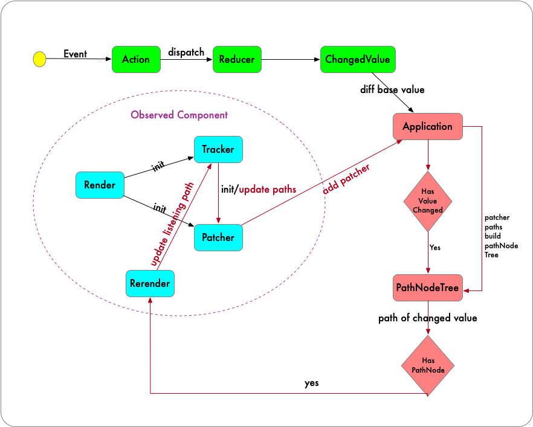

# Relinx

[](https://www.npmjs.com/package/relinx) [](http://www.npmtrends.com/relinx) [](https://github.com/prettier/prettier)

_A fast, intuitive, access path based reactive react state management_

## Features

1. 支持 ES5 和 ES6，通过`Proxy`或者`defineProperty`等 trap 函数，自动记录当前组件所需要响应的属性路径
2. 当源数据发生变化时，只对其对应的 Proxy 对象进行 relink 替换，尽量减少 Proxy 对象的创建
3. 对 PathNode 进行创建时，只会对那些被使用到的属性才进行创建，从而在进行 diff 遍历时提高性能
4. 为了更好的拥抱社区，中间件是基于 Redux-middleware 来实现，可以很快的接入 Redux 社区丰富的中间件库
5. 通过 access paths 的记录，可以更精准的知道组件具体需要的属性以实现粒度化渲染的控制

## Introduction

遵照`React-Redux`的模式，包含`action`和`dispatch`；但是最终在结构上参考了[dva](https://github.com/dvajs/dva)中的基本概念，比如`model`, `reducers`和`effects`.相比于`dva`借助`redux-saga`实现副作用处理的多样性；目前 relinx 通过基于`redux-thunk`的中间件实现对异步数据的处理。

Relinx 的底层路径搜集上受 functional reactive programming 很大的影响，实现上很大程度借鉴了[immer](https://github.com/immerjs/immer)对 Proxy 和`defineProperty`的处理方式。收集模块叫`Tracker`，借鉴了[Tracker - Meteor's reactive system](https://docs.meteor.com/api/tracker.html)的定义方式。

Relinx 的设计理念很简单

> 记录组件访问的具体属性路径，当源数据变化时触发对应节点上监听的组件



### Tracker

[Tracker - Track the getter action of wrapped object and provide ability to relink when upstream object's value changed](./src/tracker/README.md)支持 Relinx 进行 paths 收集的模块

## 安装

```bash
$ npm install relinx --save
```

## 基本概念

首先看下面一个最简单的例子

```js
// index.js
import React from "react"
import ReactDOM from "react-dom"
import {logger, Provider, createStore, applyMiddleware, thunk} from "relinx"
import Models from "./models"

import App from "./views"

const store = createStore(
  {
    models: new Models()
  },
  applyMiddleware(thunk, logger)
)

const Simple = () => (
  <Provider store={store}>
    <App />
  </Provider>
)

ReactDOM.render(<Simple />, document.getElementById("app"))
```

```js
// models.js
import appModel from "./appModel"

export default () => ({
  app: new appModel()
})
```

```js
// appModel.js
export default () => ({
  state: {count: 0},
  reducers: {
    increment: state => ({count: state.count + 1})
  }
})
```

```js
// app.js
import React, {useCallback} from "react"
import {useRelinx, observe} from "relinx"

export default observe(() => {
  const [state, dispatch] = useRelinx("app")

  const {count} = state
  const handleClick = useCallback(() => dispatch({type: "increment"}), [])

  return (
    <div>
      <span>{count}</span>
      <button onclick={handleClick}>+</button>
    </div>
  )
})
```

### state

在 component 中可以通过`useRelinx`方法返回一个 state. 这个是一个独立的`proxy`对象；每一次 property 的调用都会被记录下来作为当前 component 会访问到的 paths。

### action

action 由两部分组成`type`和`payload`，和`Redux`中的概念一样，是 state 进行更新的唯一方式；然后通过`dispatch`进行调用

### reducers

进行同步的数据处理，与`action.type`相对应；对`action.payload`进行处理返回更改后的值

### effects

进行异步的数据处理，包含所有的 ajax 请求

## API

### observe(FunctionComponent)

将一个 functional component 声明为 access path sensitive. component 只有在外层或者 parent component 进行 observe 函数封装以后才能够在 component 中使用`useRelinx`方法

observe 的作用是创建一个 Tracker scope，同时可以认为是一个粒度化渲染的区域划分；同时为了方便进行 DEBUG 信息的显示，最好使用`name function component`

```js
const A = () => <span>hello world</span>
const ObservedA = observe(A)
```

#### 什么时候使用 observe

理论上，任何组件都可以进行 observe 的封装；observe 的调用会创建一个`Proxy State`的作用域，比如说子组件中的值更改，只想重新渲染子组件，这个时候就需要在子组件外层进行 observe 的封装

### useRelinx

```js
const [state: Proxy, dispatch: Function] = useRelinx((modelName: String))
```

它返回包含长度为 2 的数组。第一个值是`state`，它的值是和`modelName`进行对应；同时需要注意调用`useRelinx`方法的组件外层最好有`observe`处理

```js
const A = observe(() => {
  const [state] = useRelinx("app")
  return <span>{state.count}</span>
})
```

### useDispatch

```js
const [dispatch: Function] = useDispatch()
```

针对一个组件不需要 state 的情况下，只返回一个`dispatch`函数

## Redux vs Relinx

### 相同点

- 对于`action`的处理方式上都是一致的；`dispatch`是所有`action`的原动力；

### 不同点

- 数据绑定的方式，`redux`主要是通过`mapStateToProps`，`mapDispatchToProps`以及`connect`实现组件层面和数据源的绑定；当`Provider`层数据源发生变化时，调用变化数据部分`connect`组件。`Relinx`是基于`Proxy`提供的`trap`来实现，对于组件中使用到的[`get(proxy[foo]和proxy.bar)`](https://developer.mozilla.org/en-US/docs/Web/JavaScript/Reference/Global_Objects/Proxy/handler/get)进行`reactive path`的订阅，当`reactive path`被命中时就触发当前组件的更新
- `dispatch`处理的数据类型；`redux`可以支持`action`以及`function`的`dispatch`操作；`Relinx`只支持`action`的处理，`dispatch function`可以通过提供对应的`action`和`payload`实现调用
- `dispatch`用法上的区别；在`redux`中可以连续的进行`dispatch`操作；而对于`relinx`如果说想要连续操作两个或者以上的`action`的话，需要通过数组的形式来提供`dispatch([...actions])`否则中间的改变值会被抹掉
- `reducer`返回值的区别；在`redux`中每一个`reducer`返回的应该是一个全量的`state`，所以它的返回形式是`{...state, [updatedKey]: updatedValue }`；而对于`Relinx`它返回的是当前`model`中变化的部分也就是`{[updatedKey]: updatedValue}`

### 如何实现`object.property`粒度化的响应式

比如说一个场景，渲染`list`为了尽量不更改`list.item`中的数据；如果说存储`item`是否被选中；在`Redux`中的实现方式一般如下；它存在的问题是每一次`isItemsSelected`发生变化的话，所有的`item`其实都会被`re-render`；（对于这个问题其实有其它的方式来解决了）

```js
const Item = props => {
  const {isItemsSelected, itemIndex} = props

  return <div>{isItemsSelected[itemIndex] ? <Selected /> : <Unselected />}</div>
}

const mapStateToProps = state => {
  return {
    isItemsSelected: state.isItemsSelected
  }
}
```

`mobx`中的实现方式是通过[`expr`](https://mobx.js.org/refguide/expr.html)

```js
const TodoView = observer(({todo, editorState}) => {
  const isSelected = mobxUtils.expr(() => editorState.selection === todo)
  return (
    <div className={isSelected ? "todo todo-selected" : "todo"}>
      {todo.title}
    </div>
  )
})
```

## 问题

### dispatch actions

当存在多个 actions 时，不能够连续调用 dispatch；因为中间 action 会被覆盖掉；具体可以参考 Dan 的描述https://twitter.com/dan_abramov/status/1096898096011886592?lang=en


在 Relinx 可以通过数组的形式来解决这个问题

```js
dispatch([action, action, action])
```

### 数据比较的原则

1. primitive value 的话，直接对比字面值是否一样
2. 数组和对象首先比较引用，为了提高对比的效率如果一样就不再进行它的 properties 的对比

### 对 Map 和 Set 的支持

目前支持 primitive type，array 和 object 等数据类型，暂不支持 Map 和 Set 数据结构，

### 对 ES5 支持存在的问题

#### 使用到的 property 必须都声明

因为`defineProperty`不支持对未声明属性的 getter trap，如果说希望 ES5 和 ES6 表现一致的话，需要再 model 中对需要使用到的 property 都进行声明，否则会出现在 ES5 中某一个字段更新但是没有重新渲染的问题。

```js
// appModel.js
export default () => ({
  state: {location: {}}
})

// view.js
const A = observe(() => {
  const [state] = useRelinx("app")
  return <span>{state.location.city}</span>
})
```

需要更改为下面的形式

```js
// appModel.js
export default () => ({
  state: {
    location: {city: null}
  }
})
```

_对于空值要定义为`null`，而不是`undefined`；Relinx 会通过比较 type 是否是`undefined`来确定这个 property 是否是声明过的_

如何知道哪些字段没有声明过？

Provider 支持`strictMode`属性，可以在开发阶段设置为 true

```js
<Provider strictMode>
  <App />
</Provider>
```

### ES5 对 Array 处理的支持

Tracker 对 Array 的`prototype` function 进行了覆盖，比如`map`,`filter`...等函数调用的时候，都会自动将`length`作为 component 的监听对象；所以组件是可以对 array 的`length`变化进行响应的

唯一存在的问题是，当使用`for`语句时不能够对`array.length`进行监听；因为`array.length`的`configurable`属性是`false`；不能够对它的`descriptor`进行重载

### 如何防止 memory leak

### 如何进行 array item 的粒度化渲染控制
