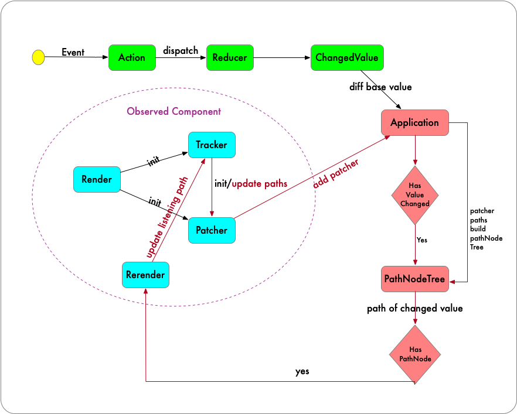
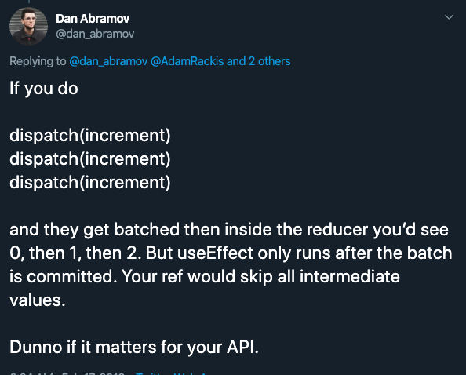

# Relinx

[](https://www.npmjs.com/package/relinx) [](http://www.npmtrends.com/relinx) [](https://github.com/prettier/prettier)

_A fast, intuitive, access path based reactive react state management_

## Features

1. `ES5` and `ES6` supported. use traps functions to collect accessed property path of React component.
2. When base data updates, relink the changed proxy object and leave others untouched.
3. `PathNodeTree` is the data structure to perform diff action. In Relinx, Only accessed property paths are used to build `pathNodeTree` which help to optimize comparison performance.
4. In order to embrace `React-Redux` community, middleware is re-write base on `Redux middleware`.
5. Fine-grained render controls. According to `pathNodeTree`, we can know which component should update when base value changes.
6. Functional component only, and React `Hooks` supported

## Introduction

Conceptually, Relinx is inspired by lots of open source library likes `React-Redux`, `dva` etc. It includes `action`,`reducers`, `dispatch` and `effects` as well.

On handle side effect, In order to simply learning curve and leverage usage complexity, Relinx do not apply any other library like `redux-saga` and use a variant of `redux-thunk`.

The Relinx design principle is very simple

> Collect accessed properties paths of component, then re-render component if bind pathNode detect value change.



1. A observed component will create a tracker and patcher. Tracker is used to collect access paths. Patcher is used to re-render component when access path value change.
2. Patcher will be added to top level application. According to patcher's paths value, application will create a PathNodeTree
3. Dispatch an action to reducer will create changed value group. In order to find which paths value has been updated, changed value will be passed to application.
4. In application, Based on created PathNodeTree, perform diff algorithm. If a pathNode is detected with value change. Its patcher will be pushed to pendingPatchers.
5. Once comparison and patcher clear up is finished. pendingPatchers will be trigger running. The related component will be re-rendered.
6. Component's re-render will cause the re-creation of tracker paths. component will patcher will be add to application again to update PathNodeTree.

## Mechanism

- [What is Tracker](./src/tracker/README.md)

## Install

```bash
$ npm install relinx --save
```

## Concept

The following is a simple Relinx usage example.

```js
// index.js
import React from "react"
import ReactDOM from "react-dom"
import {logger, Provider, createStore, applyMiddleware, thunk} from "relinx"
import Models from "./models"

import App from "./views"

const store = createStore(
  {
    models: new Models()
  },
  applyMiddleware(thunk, logger)
)

const Simple = () => (
  <Provider store={store}>
    <App />
  </Provider>
)

ReactDOM.render(<Simple />, document.getElementById("app"))
```

```js
// models.js
import appModel from "./appModel"

export default () => ({
  app: new appModel()
})
```

```js
// appModel.js
export default () => ({
  state: {count: 0},
  reducers: {
    increment: state => ({count: state.count + 1})
  }
})
```

```js
// app.js
import React, {useCallback} from "react"
import {useRelinx, observe} from "relinx"

export default observe(() => {
  const [state, dispatch] = useRelinx("app")

  const {count} = state
  const handleClick = useCallback(() => dispatch({type: "increment"}), [])

  return (
    <div>
      <span>{count}</span>
      <button onclick={handleClick}>+</button>
    </div>
  )
})
```

### state

In `observe` wrapped component function, calls `useRelinx` will return an array value. The first item is `Proxy State` which is decorated with getter trap. Accessed path will be collect when its property is used.

### action

Action is composite of `type` and `payload`. Its usage is the same as in `Redux`. It is the only way to trigger state update, which should be called with `dispatch` function.

### reducers

Process action in sync way, and result in changed value.

### effects

Backend with a `redux-thunk` variant, Process action in async way. all the `ajax` should be placed here.

## API

### observe(FunctionComponent)

_wrap a functional component and make it access path sensitive_

It's a prerequisite when you want `useRelinx` in component. The usage of `observe` is to create a `Tracker` scope. Scope is made to achieve `fine-grained` re-render control.

In order to make `DEBUG` info easy to read, it'd better to wrap a `named` function component, like as follows.

```js
const A = () => <span>hello world</span>
const ObservedA = observe(A)
```

#### when to use observe

Theoretically, any React component is recommended to wrapped with observe function. It will create an individual update context for wrapped component. However, it only meaningful when the component has `proxy state` passing from parent or use `useRelinx` method.

### useRelinx

```js
const [state: Proxy, dispatch: Function] = useRelinx((modelName: String))
```

`useRelinx` will return a two length array value.

The first item is `state`. `state` is an `proxy` object, and its value is derived from store base value and configuration in exported `model` file. Refer to usage example listed above.

```js
const A = observe(() => {
  const [state] = useRelinx("app") // state value: { count: 1 }
  return <span>{state.count}</span>
})
```

The second item is `dispatch`, The same usage as in `React-Redux`

#### Point to note

1. `useRelinx` could only be used in functional component
2. When use `useRelinx`, component or its ancestor component is required to be wrapped with `observe` function
3. It'd better to wrap component with `observe` function when use `useRelinx`

### useDispatch

```js
const [dispatch: Function] = useDispatch()
```

A straightforward hooks method to return `dispatch` if you do not need state.

### Props

#### useProxy

By default, its value is `true`. It makes `backend` Tracker to use `Proxy` or `defineProperty`. However, `Tracker` will detect current context whether `Proxy` is supported first. If it's false, `useProxy` value will be ignored.

#### strictMode

By default, its value is false. Normally, it is used on dev condition. It helps to log the undeclared properties used by `state`. It's meaningful when `ES5` should be supported. [The below section have made a detail explanation](#do-not-use-undeclared-properties)

#### namespace

It is optional, In order to support multiple `Provider` in `app`, Relinx will create a random `namespaceKey` if it is omitted.

## FAQ

### How to dispatch actions

Do not attempt to call consecutive `dispatch`, the intermediate action will omitted. You could find the answer from [Dan's tweet](https://twitter.com/dan_abramov/status/1096898096011886592?lang=en)



In Relinx, you can dispatch an action array to fix.

```js
dispatch([action, action, action])
```

### The principal of data diff

1. For primitive type value, the literal value should be equal.
2. For Array or object, the comparison will break if their reference are equal. or comparison will continue until `pathNode` is exhausted.

### The Map and Set support

Recently, Relinx only support `Primitive Type`, `Array` and `object` types.

### Point to note when use on ES5

#### Do not use `undeclared` properties

For `ES5`, `Tracker` use `defineProperty` to re-define `getter` trap. However, it is not possible to define `getter` trap on `undeclared` properties, which means `Tracker` can not collect paths of these kinds of property access correctly. By the way, component re-render is derived by paths, which may cause non-update even though base value update.

```js
// appModel.js
export default () => ({
  state: {location: {}}
})

// view.js
const A = observe(() => {
  const [state] = useRelinx("app")
  return <span>{state.location.city}</span>
})
```

`appModel.js` should be the following format.

```js
// appModel.js
export default () => ({
  state: {
    location: {city: null}
  }
})
```

_About empty value, it should be defined as `null` instead of `undefined`. Because Relinx will check property value's value, if it is `undefined`, it will be regarded as `undeclared` property. which may make confuse when `strictMode` is set true_

##### How to find undeclared properties

Set true value to `Provider`'s `strictMode` prop. Then you can check warning in console log.

```js
<Provider strictMode>
  <App />
</Provider>
```

### When use `array.length` take care

1. For ES6, `array.length` could be trapped by `getter` trap automatically, so it has no problem when calls `map`, `filter` etc.
2. For ES5, the descriptor of Array's proto functions like `map`, `filter` etc could be override. `Tracker` will collect `length` path when calls these functions. However, there is an exception. `array.length`'s descriptor could not be override, which means `for` statement should be take care. You will lost `length` path if you write `arr.length` as condition statement.

### How to prevent memory leaks

For `memory leaks`, it always talk about how to remove unused subscriptions. In Relinx, subscription happens when add a `patcher` to `pathNode`. When `pathNode` find property value changes will do the following actions:

1. If it is primitive type value, compare its literal value. if not equal, `patchers` will be pushed to `pendingDispatchers`, and remove `patchers` from other `pathNodes`
2. If it is Array type value, and has new element added. add `patchers` to `pendingDispatchers`, and remove `patchers` from other `pathNodes`
3. If it is Array type value, and has element deleted. add `patchers` to `pendingDispatchers`, and these removed elements will not perform comparison action. After finish comparing `PathNodeTree`, destroy these `remove` PathNode.
4. If it is object type value, has key removed and this key has related `pathNode`. add `patchers` to `pendingDispatchers`, at the mean while, continue the comparison of remove keys. After finish comparing `PathNodeTree`, destroy these `remove` PathNode.
5. When component is un-mount, its related patcher will be destroyed.
6. When component is re-rendered, the paths of patcher will be updated, and re-bind `patcher` to `pathNode`

### How to optimize array re-render

For array's re-render, basically it caused by two factors: `length` change or `item[key]` change.

#### length changed

In general, the change of length value will cause `items`'s component to re-render. On the base of React update mechanism, parent component will trigger child components' re-render. For this situation, `React.memo` could help to isolate update if it is unnecessary to child component

#### item[key] changed

It is recommend that parent and child component should be wrapped with `observe` function. If `item[key]` changes, it will only trigger corresponding child component to re-render.

### How to perform selector on compared Object

Comparing with `Redux`, it use `shallowEqual` to verify value's update. `mapStateToProps` will be called on every time `state` changes which cause unnecessary keys' comparison or make performance issue. `React-Redux` official suggest to use [reselect](https://github.com/reduxjs/reselect) to avoid this kind of issue.

However, Relinx create `pathNode` for accessed property，and only property with `pathNode` will perform diff algorithm. So unnecessary keys' comparison could not happen by default.
