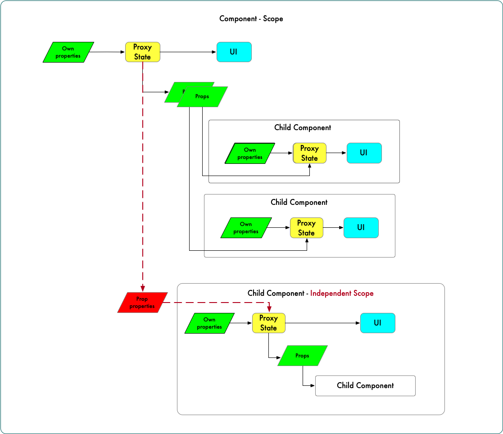
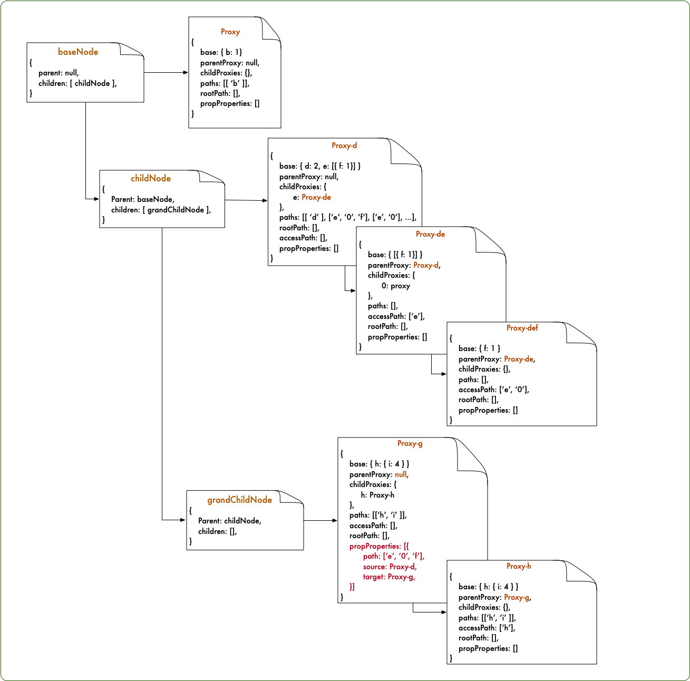
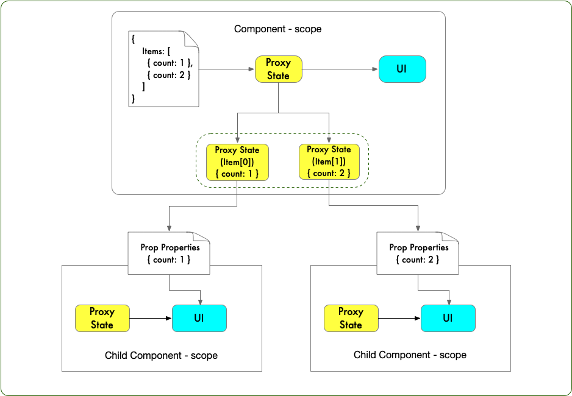
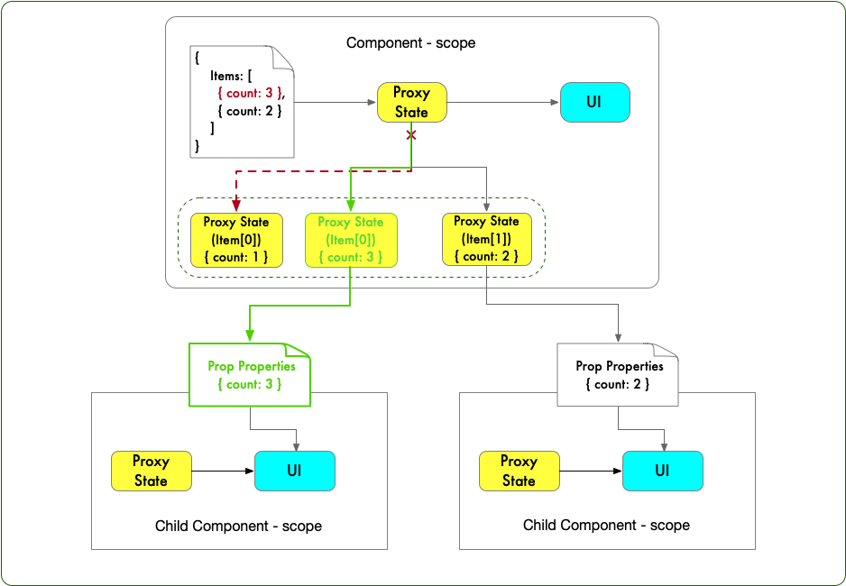

# Tracker

_Track the getter action of wrapped object and provide ability to `relink` when upstream object's value changed_

> The original idea is to provide a solution on collecting the used property when render a react component. With this purpose, the question become how to utilize getter trap. `Proxy` has been supported by most of browser engine.. So how about the ES5 users?

> With these concern, an absolutely fantastic library [immer](https://github.com/immerjs/immer) give me the inspiration.

## Scope

when develop an app, state is designed to connect with UI view. state's value change will trigger UI update. Combined with [scope](<https://en.wikipedia.org/wiki/Scope_(computer_science)>) concept, it become possible to isolate the paths collector and simplify the result when it has nest group. Here we introduce some necessary definition.

1. **own properties**: It's the base data.
2. **props**: Following the basic concept in React, it's the value passing from upstream parent component.
3. **prop properties**: when you has a nested independent scope, the **props** passing from parent component will be called `prop properties`.
4. **Tracker**: To create an independent scope.
5. **Proxy State**: Implement the getter trap functionality.



Then it has following design rules:

1. A `Tracker` could have multiple child `Tracker` instance.
2. A `Tracker` has at most one `Proxy State`.
3. A `Proxy State` could have multiple child `Proxy State`
4. `Proxy State` will report `paths` to self or to ancestor `Proxy State` which has no null parent `Proxy State`.

### Implementation

The following is an example about how to create an instance, and get its paths value. You can provide a `parent` param to specify the parent node, or the previous tracker will be considered as `parent`. The following image shows the basic logic implementation.

```js
const base = {
  a: {
    b: 1
  },
  c: {
    d: 2,
    e: [{f: 1}]
  },
  g: {
    h: {i: 4},
    j: 5,
    k: 6
  }
}

const baseNode = Tracker({base: base.a})
const b = baseNode.proxy.b
baseNode.proxy.runFn("getRemarkableFullPaths") // [[ 'b' ]]

const childNode = Tracker({base: base.c})
const c = childNode.proxy.d
const f = childNode.proxy.e[0].f
const item = childNode.proxy.e[0]
childNode.proxy.runFn("getRemarkableFullPaths") // [["e", "0"], ["e", "0", "f"], ['d']]

const grandChildNode = Tracker({base: base.g})
const i = grandChildNode.proxy.h.i
const ff = item.f
grandChildNode.proxy.runFn("getRemarkableFullPaths") // [["h", "i"], ["e", "0", "f"]]
```



### What is relink

The following two images provide a straightforward explanation of why relink needs and how it works. The first one describe a general scenario when write a react component: A parent component pass a item (props property) to each of its child component.

_note: for props property, please refer to definition listed on above_



A user dispatch an action which update the value of `item[0]` to `{ count: 3 }`. So how to make a fine-grained rendering update...

The basic method is to trigger parent component's re-render, then the consecutive child components will be updated.for this kind, it will cause huge performance issue. As we know, `selector` could be helpful on this condition..

`selector` is a function to let store know what kind of properties it listen to. According to Tracker's original idea, it has helped us reach this step automatically.But there will come with a new issue, `{ count: 1 }` is a prop value passing from parent. If the parent component not re-render, how could I get the latest value. It's exactly the problem what `relink` attempt to resolve.

`break the old connection, then re-build a new link with child component`



## Relink functions

It's meaningful only when we define `Tracker` node...

### relink

### relinkProp

### rebase
