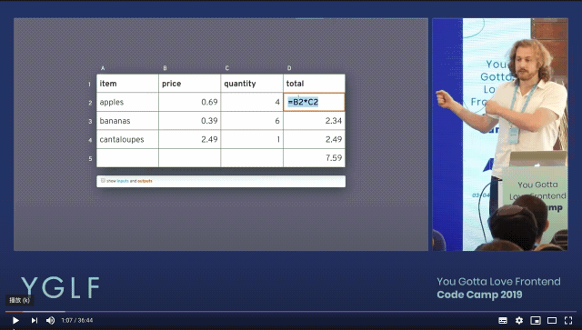
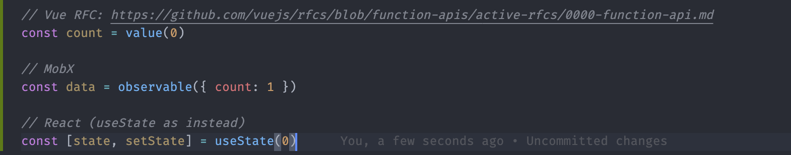
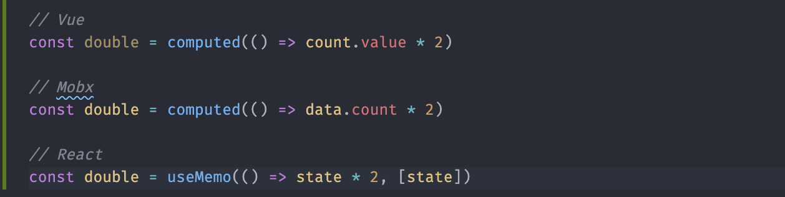
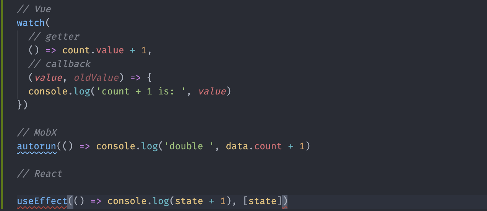

## Introduction

前端框架随着KnockoutJS, Meteor, Angular, React, SolidJS, Vue等框架的引入，一方面解决Data/View的耦合，同时也逐渐的引入Fine-Grained Reactive Programming的思想

React是一个存粹的View框架，它只负责渲染层面的处理，而真正对数据流的控制和绑定都是通过第三方来支持

React社区目前的状态管理层出不穷，他们之间有各自的优缺点
- Redux action和reducer的繁琐一直被诟病
- MobX给React增加了Reactive的能力，并且有丰富的API；但对于庞大的项目并且存在多个state之间的数据共享时，inject太多state在维护性增加了难度
- dva 引入的概念比较适中并且容易上手，但是对于saga的内置有一定的使用的上手成本

在粒度化渲染控制层面，存在selector function, Proxy-base Tracking等方式；在渲染层面Proxy-base Tracking强调的是自动更新，一旦值改变和它关联的component必须更新；而基于selector function方式的渲染，在书写层面需要开发者进行感知，也不是一个舒服的方式。

:::tip
Relinx概念层面来自dva，在粒度化渲染的处理上借鉴Meteor, observe-util, immer等库的实现方式，提供了基于访问路径的状态管理
:::

## Fine-grained Reactive Programming

### Modern Reactivity

http://youtube.com/watch?v=AdNJ3fydeao

目前社区开源库类（框架和状态管理）如Vue, Solid, Meteor, KnockoutJS, Svelte, Cycle, MobX等，主要都是解决下面两个关键字Observable和Computed；

#### Observable
> getter function to make object observable and collect dependencies. 

#### Computed
> setter function to derive value or perform auto run

##### Pure function to derive value
Pure function能够确保在输入一样的情况下，output都是一致的；所以，目前它主要用来做衍生值的推导

##### Impure function to perform side effect
Impure function的话，它是不遵守输入一样，输出一致的原则；所以它的使用上是针对一个action（比如打日志，触发其它函数的执行）

## Relinx Basic Usage

### state
数据源，它里面的属性最终通过useRelinx(Hooks)或者inject(Class)来引入

### reducers
进行同步的数据处理，与`action.type`相对应；对`action.payload`进行处理返回更改后的值

### effects
进行异步的数据处理，包含所有的 ajax 请求
### subscriptions
解决derived value；比如app层的userInfo，同时被A，B两个组件使用，这个时候可以在A，B的model中通过subscriptions来监听app中的userInfo

### observe

约束粒度化到的组件

### useRelinx

返回一个observable object state，当组件使用到了state中的值的话，当前值的path会被进行上报

### Class Component

#### inject

将store注入到组件中，并且在组件中通过props.state进行访问

## State management
React Context可以有效的解决props drilling的问题，所以大部分的状态管理都是基于它进行实现；但是Context存在一个很大的问题是，它其中属性值的更新会造成connect component都进行更新；

问题1可以很好的规避掉；接下来的问题就是如何进行知道每一个组件到底使用到了哪些字段，从而实现当属性值更新进行定点更新，这个问题也是大部分状态管理所要解决的核心问题，

问题2解决了，接下来又面临如何提供高效的更新机制，比如如何减少不必要的属性比较，减少不必要的计算；

### Render Optimization Strategy

对于2中涉及到的使用属性的收集，此处不再赘述；下面主要描述在Render Optimization层面所涉及到的不同策略

Render Optimization Strategy	Library
	code snippet
Selector Function

Redux，zustand, rematch

开发者提供一个Pure Function
每一次的state更改都会触发selector执行
开发者在selector进行缓存，derived value，只对使用到的属性进行diff处理等操作

reselect#motivation-for-memoized-selectors

Proxy-based Tracking	MobX, react-tracked, relinx
Proxy进行依赖收集，状态库会自动帮你识别当前组件关心的属性，当该属性发生变化时触发相应组件的更新

依赖收集提供了粒度化的基本能力
MobX（observer）, Relinx（observe）, observe-util（observe）等提供各自的update scope实现

atoms	Recoil, jotai
伴随着 Recoil 在社区活跃，atom abstraction概念被进行了推广。开启了non-external store的形式
它的特点是基于React setState来实现，所以完美支持concurrent mode属性；同时它强调是state share。也就是各个组件引用的是同一个对象，当值更改时则会更改所有关联的属性
但是它的粒度化，也是依靠类如selector function的方式

Recoil
external store：React-Redux, MobX, Relinx等通过外部store进行注入
internal store: Recoil，初始化的时候没有store的存在，state是通过动态的方式进行添加

https://blog.isquaredsoftware.com/2017/12/idiomatic-redux-using-reselect-selectors/

Good Practices
React devTool

最新的new-react-devtools 支持在chrome中高亮被更新的component；开启方式【Components → Setting Icon → Highlight updates when component render】

下面是一个简单的例子（relinx/examples/basic)：

进行单个item值的更新，它只会对当前item进行更新
如果移除一项的化，它只会触发当前项下面的组件更新

Use Cases

	Rules	Descriptions

基本操作

不要使用变化的函数

	比如React用useCallback
不要使用新的对象

在数组渲染时使用key并且key的值不能是index

不要使用index作为props

不要在外层解构完再传入子组件

对于高频操作的模块，单独抽离成组件，并且加上渲染优化策略

Relinx

	对组件尽可能的使用observe封装	每一次的observe封装都会将组件更新紧缩一个scope
对于连续的action作为array进行dispatch

举些栗子
$ git clone git@code.devops.xiaohongshu.com:fe/web/relinx.git
$ cd relinx
$ npm i
$ npm run storybook
How to split store state

view-model

尽量针对模块进行state的拆分，每一个block view有一个state

shared values	尽量实现数据层的【自给自足】，不要进行其他store的inject；在Relinx中推荐使用subscriptions

Relinx Design Pattern

Observe

Relinx如何实现只触发Item 1的更新？
每一次observe的嵌套，都会增加一层的state context，当组件运行时，所有的属性访问都会归并为当前context，也就是当前组件的访问路径集
凡是上游传递的mutable object都不会进行是不是observable对象的判断；如果是observable对象的化，那么它的值每一次都是从顶层state进行访问获取
当出现changedValue时，Relinx会根据收集的路径进行diff判断，得到具体变化的路径，然后更新相应的组件

何时使用observe？

推荐的方式是，任何Component都被推荐observe进行封装，每一次的封装会增加一个粒度化的渲染层

Performance

https://code.devops.xiaohongshu.com/qinglong/js-framework-benchmark

	场景

create row	创建1000行	主要验证在初始化时的效能，本身plain object的访问是最高效的，这里主要是验证响应式在Proxy使用上的性能损耗

replace all rows	新的1000行替换刚刚创建的1000	验证在unmount时的损耗

partial update	更改其中一个item的值	验证在粒度化渲染时，如果确保只对指定的行进行UI的更新

select row	点击选中其中一行反选刚刚选中的行	与partial update的区别是，一般这个值不是item中的固有属性，其实它强调的是组件层面的derivated value

swap rows	交换两行	如何确保只进行位置的交换，而不做多余的更新

remove row	删除一行	主要考察在数组length改变时，在返回值上的策略

create many rows	创建10000行	存粹验证初始化的消耗

append rows to large table 	追加1000行到一个大的列表	初始化性能

clear rows	清空	在teardown时的性能，比如依赖解除

问题点
为什么React-Hooks性能是最好的
本身是基于React-reducer-setState这一原生功能，并且它处理的都是plain object；对于响应式的数据，本身在创建时就有很大的性能开支
使用了React.memo对渲染进行优化
为什么partial update比较看起来可能存在问题
首先明确的是，不只是relinx才支持粒度化，所有的状态管理都具备
remove是不是存在问题？
What about Relinx Performance
依赖的收集是动态支持，这样可以有效的规避掉判断语句下引入的不必要的依赖字段
通过observe的调用，可以使粒度化的更新渗入到任何子组件
dispatch action array，会将更新的数据整合，同时等到subscriptions也更新完以后才会触发下一次的UI更新
State Management Comparison
序号	功能	描述
1

是否支持Hooks

2

是否支持Class

3	是否支持渲染优化（粒度化）

4

是否支持Concurrent Mode（CM）

	CM目前仍旧未release状态，目前可以知道的是Recoil支持
5

是否支持model的动态引入

	当动态化时，动态引入只需要的model会成为必要
6

TS对SafeAction的支持，自动提醒action type，并且在payload输入错误时进行提醒

typesaft-actions：针对Redux的类型安全方案

7

是否支持路由切换时store的保存

	针对RN的场景问题，因为本身RN进入到下一个路由时上一个页面不销毁
8

是否支持页面之间store的隔离

	针对RN的场景问题
9

是否支持页面支持store的通信

	针对RN的场景问题
10	是否可自定义diff method	考虑到性能问题，目前store的处理方式都是进行shallow compare；但是有一些场景比如电商购物车每一次用户进行数量变化都是一个全量数据的获取；所以，在一定程度的deep compare也是必须的。

Library	1	2	3	4	5	6	7	8	9	10
React-Hooks	✅	❌	需要定义selector function 	✅
	❌	❌	❌	❌	❌
Redux

❌

✅

	需要定义selector function 	❌	❌	❌

	❌
React-Redux-Hooks

✅

❌

	需要定义selector function	❌	❌	❌

	❌
MobX

✅

✅

	基于Proxy，自动支持	❌	❌	❌

	❌
react-tracked

✅

❌

	基于Proxy，自动支持	❌	❌	❌

	❌
Recoil

✅

❌

	基于atom abstraction，需要定义selector function 	✅	✅	❌

	❌

Relinx

✅

✅

	基于Proxy，自动支持	❌	✅	✅	✅	✅	✅	❌
使用场景

	推荐	不推荐
React-Hooks
项目比较小，不需要在上层的视觉进行store的梳理
不涉及到各个state之间的交叉，也就是不需要用context进行值更新和传递
不需要频繁的对item进行更新

组件之间有信息交叉，比如都需要用户信息
item存在大量property，并且大部分都被组件使用到；这种情况需要写非常多的selector
每一次数据源都是新的，但是大部分的literal value并没有变，比如用户每一次加购的返回，只有一个商品的数量是变的

Redux
不太推荐，因为action，reducer概念太分散，在可维护上成本太高

MobX
大型项目
开发者能够梳理清各个state之间的关系并且对shared value有很好的规划和引入（切记，对一个component进行多个state的inject是地狱！）

新手 + 大型项目

Recoil
Recoil目前是处理shared value上是一个比较好的选择
全局store的概念，值得进行尝试

新手，因为概念比较多会有一定的曲线
对于item存在大量property，并且被使用到了很多的情况；这个可以认为selector function普遍存在的诟病

Relinx
大型项目，并且需要在整体对store进行梳理
希望得到响应式在依赖收集上的便利，同时想要在渲染层面的非被动形式。因为如果存粹的响应式，依赖一旦建立，值的变化马上会触发UI的变化，假如说关联的部分在底部很大部分区域，这个时候自动渲染其实是浪费；
对渲染具有更强的可控性，比如2已经说的问题
multiple store，store communication，isolated store等场景

适合React-Hooks的场景
存在大量删除操作的应用，目前Relinx在底层数据收集上依赖array index，针对频繁的删除操作目前是有严重性能损耗
Why Relinx？

概念上和社区尽量吻合

可扩展性（middleware）	middleware参考Redux compose思想进行串联，所以社区针对Redux的dev-tools理论上可以微调接入
定制化	契合业务进行比如model lazy，diff算法，无用渲染提醒支持等
Data与render的解藕

ProxyTracking	支持ES5/ES6，类如Vue，MobX等【自动】【动态】做到使用到属性的监听，并且触发UI联动
Relinx-Vue is possible or not ?

Vue的路径收集的方式

template中的字段 ❌
computes, watch中的字段 ✅
Future
如何提供shared state
Recoil提供的atom abstraction方式会不会是一个比较好的方式，而不是通过目前的subscriptions
提供组件层的derived value
比较常见的例子是：渲染一个列表，当点击一个item时将目前选中的item反选，同时将当前item选中
compare function
提供接受自定义的diff函数，以满足针对业务的不同需求
devTools
Relinx在最开始设计时，就围绕这尽量吻合社区概念的；所以最终形态上和Redux基本相同
devTools经过稍微调整，可以接入到Redux-devtools的生态
Related Projects

halation - RN高性能配置化

state-tracker - utility to make object trackable

Further Reading
How does Relinx work ?

subscriptions会在injectModel阶段执行一次，以确保auto run依赖树的建立
更新依赖树：rerun → 清除依赖树 → 重新创建依赖树
(dispatch → patcher + subscriptions → patcher) => update UI
Background
前端框架随着KnockoutJS, Meteor, Angular, React, SolidJS, Vue等框架的引入，一方面解决Data/View的耦合，同时也逐渐的引入Fine-Grained Reactive Programming的思想
React是一个存粹的View框架，它只负责渲染层面的处理，而真正对数据流的控制和绑定都是通过第三方来支持
React社区目前的状态管理层出不穷，他们之间有各自的优缺点
Redux action和reducer的繁琐一直被诟病
MobX给React增加了Reactive的能力，并且有丰富的API；但对于庞大的项目并且存在多个state之间的数据共享时，inject太多state在维护性增加了难度
dva 引入的概念比较适中并且容易上手，但是对于saga的内置有一定的使用的上手成本
在粒度化渲染控制层面，存在selector function, Proxy-base Tracking等方式；在渲染层面Proxy-base Tracking强调的是自动更新，一旦值改变和它关联的component必须更新；而基于selector function方式的渲染，在书写层面需要开发者进行感知，也不是一个舒服的方式。

经过多方的考量，Relinx概念层面来自dva，在粒度化渲染的处理上借鉴Meteor, observe-util, immer等库的实现方式，提供了基于访问路径的状态管理

Fine-grained Reactive Programming
Modern Reactivity

http://youtube.com/watch?v=AdNJ3fydeao

目前社区开源库类（框架和状态管理）如Vue, Solid, Meteor, KnockoutJS, Svelte, Cycle, MobX等，主要都是解决下面两个关键字Observable和Computed；

Observable

getter function to make object observable and collect dependencies. 

Computed

setter function to derive value or perform auto run

Pure function to derive value

Pure function能够确保在输入一样的情况下，output都是一致的；所以，目前它主要用来做衍生值的推导

Impure function to perform side effect

Impure function的话，它是不遵守输入一样，输出一致的原则；所以它的使用上是针对一个action（比如打日志，触发其它函数的执行）

Relinx Basic Usage

state

数据源，它里面的属性最终通过useRelinx(Hooks)或者inject(Class)来引入

reducers

进行同步的数据处理，与`action.type`相对应；对`action.payload`进行处理返回更改后的值

effects

进行异步的数据处理，包含所有的 ajax 请求

subscriptions

解决derived value；比如app层的userInfo，同时被A，B两个组件使用，这个时候可以在A，B的model中通过subscriptions来监听app中的userInfo

observe

约束粒度化到的组件

useRelinx

返回一个observable object state，当组件使用到了state中的值的话，当前值的path会被进行上报

Class Component

inject

将store注入到组件中，并且在组件中通过props.state进行访问

Vuex vs Relinx

	Vue	Relinx

Component

	data	组件内的数据源区别与来自parent的属性

	state	组件内的数据源，通过useRelinx/inject方式来注入

computed	derived value，一般都是

methods	instance中自定义的方法，可以通过dispatch进行action触发

	dispatch	通过useRelinx方式引入，可以使用它进行action的触发

watch	autoRun function，使用的值变化时触发调用，不返回值

Model

	state	store数据源

	state	store数据源

actions

触发commit，从而调用mutation方法

	reducers	消费同步的action并且返回新的state

effects	消费异步action（比如ajax）并且最终产生同步的actions

subscriptions

model层进行获取derived value

mutations	更改store中的值，从而触发UI更新

State management
React Context可以有效的解决props drilling的问题，所以大部分的状态管理都是基于它进行实现；但是Context存在一个很大的问题是，它其中属性值的更新会造成connect component都进行更新；
问题1可以很好的规避掉；接下来的问题就是如何进行知道每一个组件到底使用到了哪些字段，从而实现当属性值更新进行定点更新，这个问题也是大部分状态管理所要解决的核心问题，
问题2解决了，接下来又面临如何提供高效的更新机制，比如如何减少不必要的属性比较，减少不必要的计算；
Render Optimization Strategy

对于2中涉及到的使用属性的收集，此处不再赘述；下面主要描述在Render Optimization层面所涉及到的不同策略

Render Optimization Strategy	Library
	code snippet
Selector Function

Redux，zustand, rematch

开发者提供一个Pure Function
每一次的state更改都会触发selector执行
开发者在selector进行缓存，derived value，只对使用到的属性进行diff处理等操作

reselect#motivation-for-memoized-selectors

Proxy-based Tracking	MobX, react-tracked, relinx
Proxy进行依赖收集，状态库会自动帮你识别当前组件关心的属性，当该属性发生变化时触发相应组件的更新

依赖收集提供了粒度化的基本能力
MobX（observer）, Relinx（observe）, observe-util（observe）等提供各自的update scope实现

atoms	Recoil, jotai
伴随着 Recoil 在社区活跃，atom abstraction概念被进行了推广。开启了non-external store的形式
它的特点是基于React setState来实现，所以完美支持concurrent mode属性；同时它强调是state share。也就是各个组件引用的是同一个对象，当值更改时则会更改所有关联的属性
但是它的粒度化，也是依靠类如selector function的方式

Recoil
external store：React-Redux, MobX, Relinx等通过外部store进行注入
internal store: Recoil，初始化的时候没有store的存在，state是通过动态的方式进行添加

https://blog.isquaredsoftware.com/2017/12/idiomatic-redux-using-reselect-selectors/

Good Practices
React devTool

最新的new-react-devtools 支持在chrome中高亮被更新的component；开启方式【Components → Setting Icon → Highlight updates when component render】

下面是一个简单的例子（relinx/examples/basic)：

进行单个item值的更新，它只会对当前item进行更新
如果移除一项的化，它只会触发当前项下面的组件更新

Use Cases

	Rules	Descriptions

基本操作

不要使用变化的函数

	比如React用useCallback
不要使用新的对象

在数组渲染时使用key并且key的值不能是index

不要使用index作为props

不要在外层解构完再传入子组件

对于高频操作的模块，单独抽离成组件，并且加上渲染优化策略

Relinx

	对组件尽可能的使用observe封装	每一次的observe封装都会将组件更新紧缩一个scope
对于连续的action作为array进行dispatch

举些栗子
$ git clone git@code.devops.xiaohongshu.com:fe/web/relinx.git
$ cd relinx
$ npm i
$ npm run storybook
How to split store state

view-model

尽量针对模块进行state的拆分，每一个block view有一个state

shared values	尽量实现数据层的【自给自足】，不要进行其他store的inject；在Relinx中推荐使用subscriptions

Relinx Design Pattern

Observe

Relinx如何实现只触发Item 1的更新？
每一次observe的嵌套，都会增加一层的state context，当组件运行时，所有的属性访问都会归并为当前context，也就是当前组件的访问路径集
凡是上游传递的mutable object都不会进行是不是observable对象的判断；如果是observable对象的化，那么它的值每一次都是从顶层state进行访问获取
当出现changedValue时，Relinx会根据收集的路径进行diff判断，得到具体变化的路径，然后更新相应的组件

何时使用observe？

推荐的方式是，任何Component都被推荐observe进行封装，每一次的封装会增加一个粒度化的渲染层

Performance

https://code.devops.xiaohongshu.com/qinglong/js-framework-benchmark

	场景

create row	创建1000行	主要验证在初始化时的效能，本身plain object的访问是最高效的，这里主要是验证响应式在Proxy使用上的性能损耗

replace all rows	新的1000行替换刚刚创建的1000	验证在unmount时的损耗

partial update	更改其中一个item的值	验证在粒度化渲染时，如果确保只对指定的行进行UI的更新

select row	点击选中其中一行反选刚刚选中的行	与partial update的区别是，一般这个值不是item中的固有属性，其实它强调的是组件层面的derivated value

swap rows	交换两行	如何确保只进行位置的交换，而不做多余的更新

remove row	删除一行	主要考察在数组length改变时，在返回值上的策略

create many rows	创建10000行	存粹验证初始化的消耗

append rows to large table 	追加1000行到一个大的列表	初始化性能

clear rows	清空	在teardown时的性能，比如依赖解除

问题点
为什么React-Hooks性能是最好的
本身是基于React-reducer-setState这一原生功能，并且它处理的都是plain object；对于响应式的数据，本身在创建时就有很大的性能开支
使用了React.memo对渲染进行优化
为什么partial update比较看起来可能存在问题
首先明确的是，不只是relinx才支持粒度化，所有的状态管理都具备
remove是不是存在问题？
What about Relinx Performance
依赖的收集是动态支持，这样可以有效的规避掉判断语句下引入的不必要的依赖字段
通过observe的调用，可以使粒度化的更新渗入到任何子组件
dispatch action array，会将更新的数据整合，同时等到subscriptions也更新完以后才会触发下一次的UI更新
State Management Comparison
序号	功能	描述
1

是否支持Hooks

2

是否支持Class

3	是否支持渲染优化（粒度化）

4

是否支持Concurrent Mode（CM）

	CM目前仍旧未release状态，目前可以知道的是Recoil支持
5

是否支持model的动态引入

	当动态化时，动态引入只需要的model会成为必要
6

TS对SafeAction的支持，自动提醒action type，并且在payload输入错误时进行提醒

typesaft-actions：针对Redux的类型安全方案

7

是否支持路由切换时store的保存

	针对RN的场景问题，因为本身RN进入到下一个路由时上一个页面不销毁
8

是否支持页面之间store的隔离

	针对RN的场景问题
9

是否支持页面支持store的通信

	针对RN的场景问题
10	是否可自定义diff method	考虑到性能问题，目前store的处理方式都是进行shallow compare；但是有一些场景比如电商购物车每一次用户进行数量变化都是一个全量数据的获取；所以，在一定程度的deep compare也是必须的。

Library	1	2	3	4	5	6	7	8	9	10
React-Hooks	✅	❌	需要定义selector function 	✅
	❌	❌	❌	❌	❌
Redux

❌

✅

	需要定义selector function 	❌	❌	❌

	❌
React-Redux-Hooks

✅

❌

	需要定义selector function	❌	❌	❌

	❌
MobX

✅

✅

	基于Proxy，自动支持	❌	❌	❌

	❌
react-tracked

✅

❌

	基于Proxy，自动支持	❌	❌	❌

	❌
Recoil

✅

❌

	基于atom abstraction，需要定义selector function 	✅	✅	❌

	❌

Relinx

✅

✅

	基于Proxy，自动支持	❌	✅	✅	✅	✅	✅	❌
使用场景

	推荐	不推荐
React-Hooks
项目比较小，不需要在上层的视觉进行store的梳理
不涉及到各个state之间的交叉，也就是不需要用context进行值更新和传递
不需要频繁的对item进行更新

组件之间有信息交叉，比如都需要用户信息
item存在大量property，并且大部分都被组件使用到；这种情况需要写非常多的selector
每一次数据源都是新的，但是大部分的literal value并没有变，比如用户每一次加购的返回，只有一个商品的数量是变的

Redux
不太推荐，因为action，reducer概念太分散，在可维护上成本太高

MobX
大型项目
开发者能够梳理清各个state之间的关系并且对shared value有很好的规划和引入（切记，对一个component进行多个state的inject是地狱！）

新手 + 大型项目

Recoil
Recoil目前是处理shared value上是一个比较好的选择
全局store的概念，值得进行尝试

新手，因为概念比较多会有一定的曲线
对于item存在大量property，并且被使用到了很多的情况；这个可以认为selector function普遍存在的诟病

Relinx
大型项目，并且需要在整体对store进行梳理
希望得到响应式在依赖收集上的便利，同时想要在渲染层面的非被动形式。因为如果存粹的响应式，依赖一旦建立，值的变化马上会触发UI的变化，假如说关联的部分在底部很大部分区域，这个时候自动渲染其实是浪费；
对渲染具有更强的可控性，比如2已经说的问题
multiple store，store communication，isolated store等场景

适合React-Hooks的场景
存在大量删除操作的应用，目前Relinx在底层数据收集上依赖array index，针对频繁的删除操作目前是有严重性能损耗
Why Relinx？

概念上和社区尽量吻合

可扩展性（middleware）	middleware参考Redux compose思想进行串联，所以社区针对Redux的dev-tools理论上可以微调接入
定制化	契合业务进行比如model lazy，diff算法，无用渲染提醒支持等
Data与render的解藕

ProxyTracking	支持ES5/ES6，类如Vue，MobX等【自动】【动态】做到使用到属性的监听，并且触发UI联动
Relinx-Vue is possible or not ?

Vue的路径收集的方式

template中的字段 ❌
computes, watch中的字段 ✅
Future
如何提供shared state
Recoil提供的atom abstraction方式会不会是一个比较好的方式，而不是通过目前的subscriptions
提供组件层的derived value
比较常见的例子是：渲染一个列表，当点击一个item时将目前选中的item反选，同时将当前item选中
compare function
提供接受自定义的diff函数，以满足针对业务的不同需求
devTools
Relinx在最开始设计时，就围绕这尽量吻合社区概念的；所以最终形态上和Redux基本相同
devTools经过稍微调整，可以接入到Redux-devtools的生态
Related Projects

halation - RN高性能配置化

state-tracker - utility to make object trackable

Further Reading
How does Relinx work ?

subscriptions会在injectModel阶段执行一次，以确保auto run依赖树的建立
更新依赖树：rerun → 清除依赖树 → 重新创建依赖树
(dispatch → patcher + subscriptions → patcher) => update UI